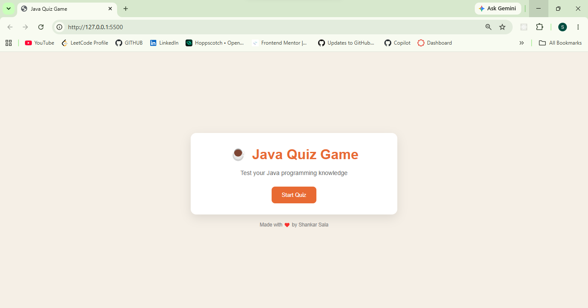
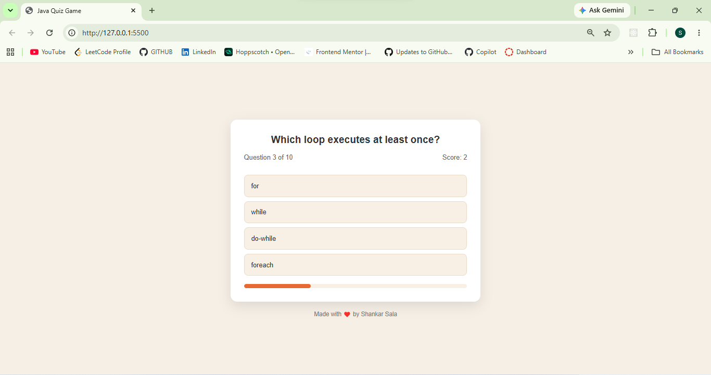
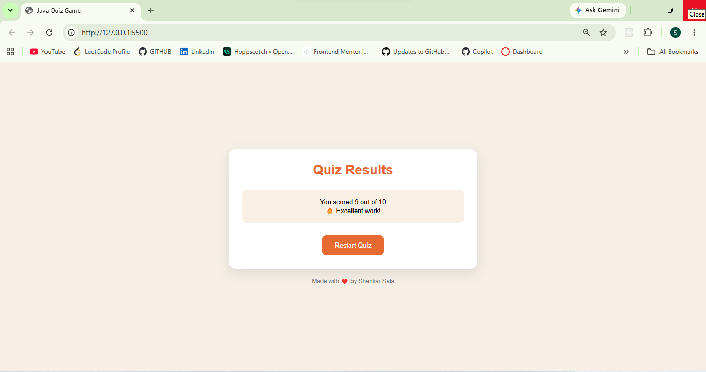

<h1 align="center">☕ Java Quiz Game</h1>

  An interactive and responsive Java Quiz Game built using HTML, CSS, and JavaScript.

  Test your Java programming knowledge with multiple-choice questions, animated UI, score tracking, and responsive gameplay.

  

  

  

  

<h2>🚀 Live Demo</h2>

  <a href="https://quiz-game-2.netlify.app/" target="_blank">
    🔗 Visit Live Website
  </a>

<h2>📸 Project Preview</h2>

  

 

  

 

  

<h2>✨ Features</h2>

<ul>
  <li>☕ Java programming quiz questions</li>
  <li>🎮 Interactive quiz gameplay</li>
  <li>📊 Real-time score tracking</li>
  <li>📈 Animated progress bar</li>
  <li>✅ Instant answer feedback</li>
  <li>🔄 Restart quiz functionality</li>
  <li>📱 Fully responsive design</li>
  <li>⚡ Smooth animations and transitions</li>
  <li>♿ Accessibility improvements using ARIA labels</li>
  <li>🔀 Randomized question order</li>
</ul>

<h2>🛠️ Technologies Used</h2>

<ul>
  <li>HTML5</li>
  <li>CSS3</li>
  <li>JavaScript (Vanilla JS)</li>
</ul>

<h2>📂 Folder Structure</h2>

<pre>
java-quiz-game/
│
├── index.html
├── style.css
├── script.js
├── images/
│   ├── screenshot1.png
│   ├── screenshot2.png
│   └── screenshot3.png
└── README.md
</pre>

<h2>🧠 Java Concepts Covered</h2>

<ul>
  <li>Classes & Objects</li>
  <li>Inheritance</li>
  <li>Polymorphism</li>
  <li>Loops</li>
  <li>Operators</li>
  <li>Collections</li>
  <li>Exceptions</li>
  <li>Data Types</li>
  <li>Methods</li>
  <li>OOP Concepts</li>
</ul>

<h2>🎯 How It Works</h2>

<ol>
  <li>User clicks the <strong>Start Quiz</strong> button</li>
  <li>Questions appear one by one</li>
  <li>User selects an answer</li>
  <li>Correct answers are highlighted in green</li>
  <li>Incorrect answers are highlighted in red</li>
  <li>Score updates automatically</li>
  <li>Final results appear after quiz completion</li>
</ol>

<h2>📱 Responsive Design</h2>

  Optimized for all devices:

<ul>
  <li>💻 Desktop</li>
  <li>📱 Tablets</li>
  <li>📲 Mobile Devices</li>
</ul>

<h2>🎨 UI Highlights</h2>

<ul>
  <li>Modern clean interface</li>
  <li>Soft color palette</li>
  <li>Rounded card layout</li>
  <li>Smooth fade animations</li>
  <li>Interactive hover effects</li>
  <li>Dynamic progress indicator</li>
</ul>

<h2>🔮 Future Improvements</h2>

<ul>
  <li>⏱️ Add countdown timer</li>
  <li>🏆 Add leaderboard system</li>
  <li>🌙 Add dark mode</li>
  <li>🔊 Add sound effects</li>
  <li>📚 Add difficulty levels</li>
  <li>🌐 Fetch quiz questions from API</li>
  <li>💾 Save high scores using Local Storage</li>
</ul>

<h2>⚡ Getting Started</h2>

<h3>1️⃣ Clone Repository</h3>

<pre>
git clone https://github.com/your-username/java-quiz-game.git
</pre>

<h3>2️⃣ Open Project</h3>

<pre>
index.html
</pre>

<h2>🤝 Contributing</h2>

  Contributions, issues, and feature requests are welcome.

<h2>👨‍💻 Author</h2>

  Made with ❤️ by Shankar Sala

